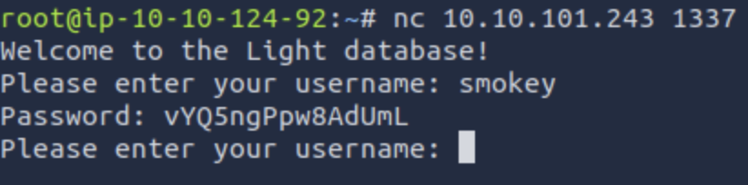

# Light
This is a write-up for the "Light" challenge on TryHackMe

https://tryhackme.com/r/room/lightroom
## Step 1: Observing behaviour of the netcat application
When you connect to the target VM using
```
nc TARGET_IP 1337
```
You are greeted with a message requesting to enter a username. We are going to enter the username 'smokey' provided with the challange:



In response, you receive a password from the user. Because this is a database, we can assume that SQL injection is a possible attack vector. So we can try something simple like:


It seems that the characters "--" are filtered out, seemingly in an attempt to resolve SQL injection vulnerability. After the second injection attempt, we receive an error message: "Error: unrecognized token:".
## Step 2: A bit of OSINT
We can look up the error message we discovered, and find that the database is running on SQLite. Using that, we can now find some specific SQLite injection prompts here: https://github.com/swisskyrepo/PayloadsAllTheThings/blob/master/SQL%20Injection/SQLite%20Injection.md
## Step 3: Injecting
Firstly, we should get all the information about the database we can. We will use this particular payload: SELECT sql FROM sqlite_master to do so.
```sql
' UNION SELECT sql FROM sqlite_master '
```


By adding <b>'</b> , we set the username to blank, so that no password would be returned. Hovewer instead of the password the database will return it's structure with help of the UNION command. However, it seems that the app filters out words such as UNION and SELECT.

We can instead try something like
```sql
' UNioN SeLeCT sql FROM sqlite_master '
```
perhaps the filter is case sensitive and won't filter out the words:


And it worked! We now know the rows in the database and the database name.

Now using this payload: 
```sql
' UNioN SeLeCT username FROM admintable WHERE id=1 OR '
```
We can go through all the usernames by their id and find that id=1 is the admin account, and id=2 is the flag account.

To get passwords for each of the accounts:

```sql
' UNioN SeLeCT password FROM admintable WHERE id=1 OR '
```

And
```sql
' UNioN SeLeCT password FROM admintable WHERE id=2 OR '
```

